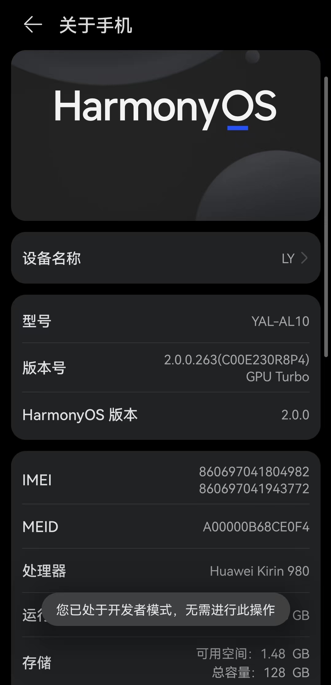
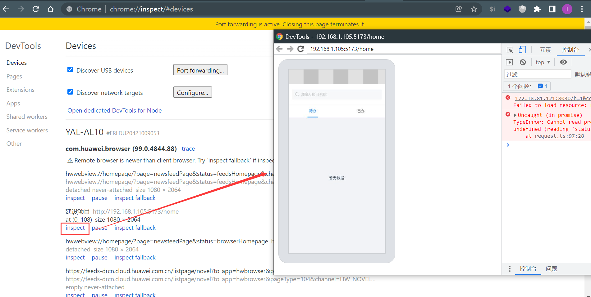
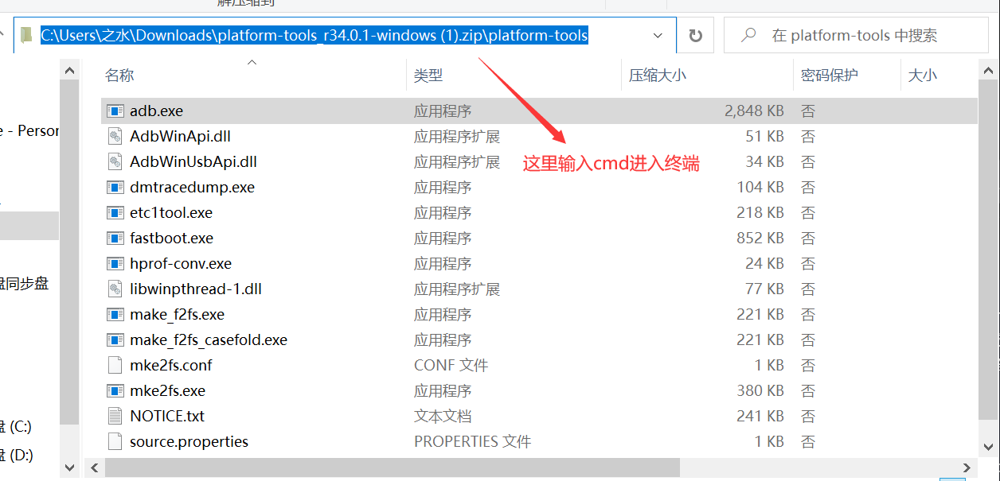
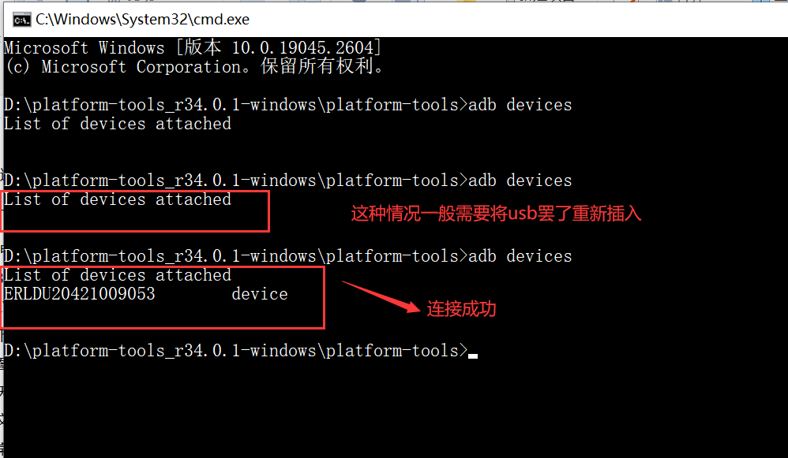
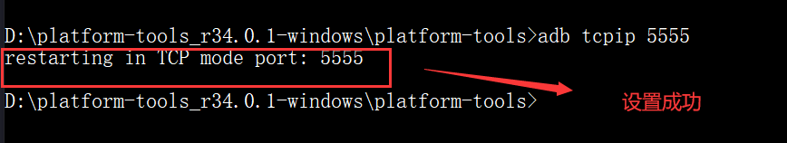
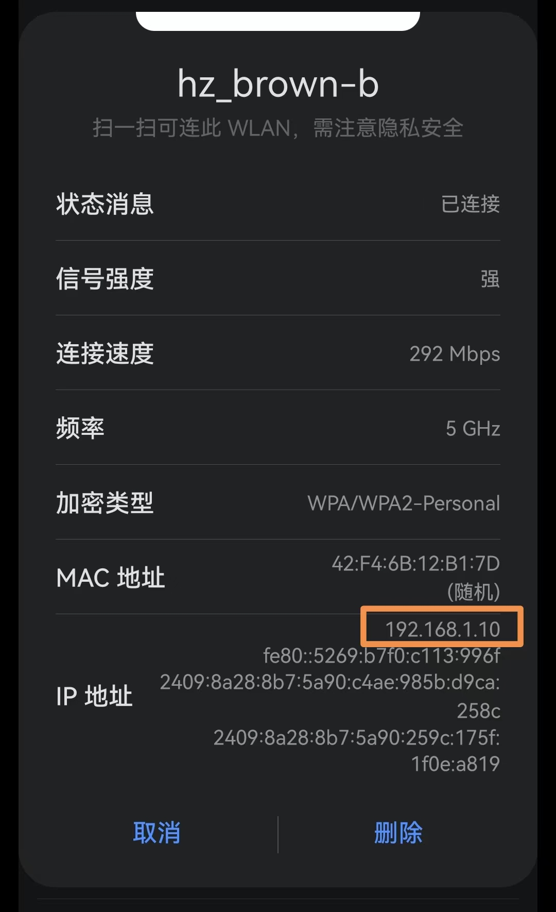
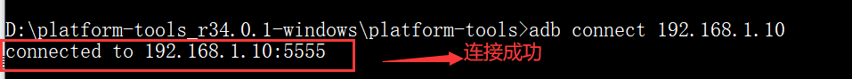

# 基于Chrome的移动端H5开发远程调试

平常移动端H5开发我们是直接在开发者工具中进行预览调试，基本上也可以满足大部分的开发要求，但是如果涉及到手机的屏幕适配，手机多指滑动的时候鼠标无法替代操作，而且电脑开发者工具中显示的页面的显示效果有时候是和手机上显示的效果是有偏差的。下面来介绍一种将手机和电脑连接从而实现可在手机上操做页面，在电脑端进行调试的方法。

不同的手机可能有的地方会有些许出入，我的是华为手机，安卓版本号为4.14.116。


## 准备工作
注意：你的手机和电脑必须处在同一局域网，也就是连接同一个WiFi。
准备一个USB线，普通的USB只有充电的功能，所以不能用，要用手机本来的充电线，才有相应驱动。

## 方法一：通过USB连接
### 1. 手机端设置
* 打开手机的开发者选项。不同的手机可能打开方式不太一样。这里仅仅以个人手机作为参考。
打开设置——>关于手机——>连点型号7次（我第一次好像没点到7次就提示你已处于开发者模式）



* 返回到设置 ——>系统和更新 ——>开发人员选项——>打开开发者选项——>(调试)打开USB调试——>（网络）选择USB配置,选择MIDI或者RNDIS(USB以太网)。

### 电脑端设置
在浏览器地址栏输入chrome://inspect, 可以看到电脑上连接的手机设备，然后在你的手机浏览器中打开项目地址，在手机上的所有操作都可以在电脑上看到。




## 方法二: 通过ADB（Android 调试桥）无线调试

***
注意，手机端需在开发者选项中打开“‘仅充电’模式下允许ADB调试”
***

 1. 下载adb, [adb下载链接](https://developer.android.google.cn/studio/releases/platform-tools?hl=zh-cn),

 下载完之后解压打开，然后在文件夹下打开终端命令行cmd
 

* 查看连接设备
```bash
adb devices
```


* 设置目标设备以监听端口 5555 上的 TCP/IP

5555可以改

```bash
adb tcpip 5555
```


* 找到 Android 设备的 所连wifi分配的IP 地址



* 通过 IP 地址连接到设备
```bash
adb connect 手机ip地址
```



如果连接不成功的话可能是你的USBy由于某种不明原因连接中断了，要不就是你输入的ip地址不对

再查看连接的终端设备，多出了手机端的连接，说明连接成功了


拔下USB线，打开chrome://inspect/#devices, 发现多了一个连接设备，下次再连接的时候就可以在终端直接输入
```bash
adb connect 192.168.1.10
```
就可以了，就不用使用USB来连接了。

注意关闭终端并不能切断连接，要用命令
```bash
# 切断所有连接
adb disconnect
# 切断某台手机ip对应连接
adb disconnect ip地址
```


