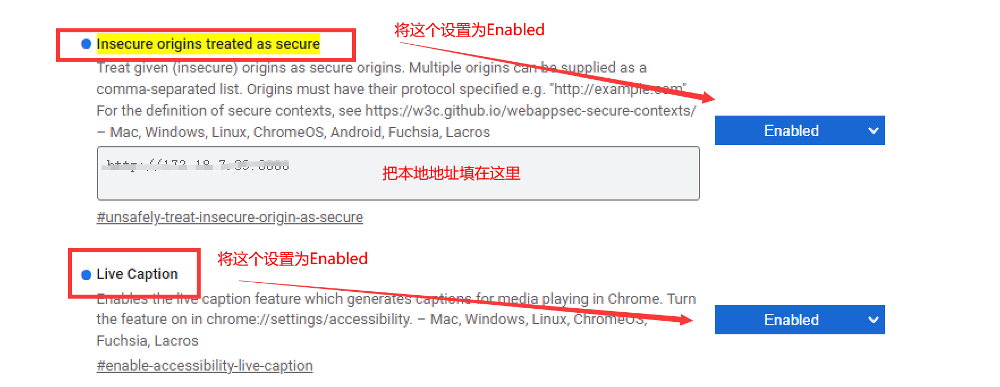

实现浏览器的页面录屏功能，主要是用到了浏览器的[navigator.mediaDevices.getDisplayMedia()](https://developer.mozilla.org/zh-CN/docs/Web/API/MediaDevices/getDisplayMedia) API

需要注意的是，调用 navigator.mediaDevices 是有安全权限的，只有满足以下任一条件才可以调用

-   localhost 域
-   开启了 HTTPS 的域
-   使用 file:/// 协议打开的本地文件

由于本地地址可能不满足这三个任一条件，所以可以跳转到 chrome://flags/#unsafely-treat-insecure-origin-as-secure 对权限进行设置


设置好之后就可以调用了

```html
<template>
 <Button @click="startRecord">录屏保存</Button>
</template>

<script lang='ts' setup>
const recordedChunks = ref<any>([])
const startRecord = async () => {
            recordedChunks.value = []
            const stream = await navigator.mediaDevices.getDisplayMedia({
                audio: true, // 设置为true之后，在弹出的窗口中会有共享系统音频的选择框
                video: true
            })
            const options = { mimeType: "video/webm; codecs=vp9" };　　// 设置编码格式
            const mediaRecorder = new MediaRecorder(stream, options);　　　　　// 初始化MediaRecorder实例
            // 设置数据可用时的回调
            mediaRecorder.ondataavailable = (event: any) => {
                if (event.data.size > 0) {
                    // 添加数据，event.data是一个BLOB对象
                    recordedChunks.value.push(event.data);
                }
            }
            // 设置录屏结束时的回调
            mediaRecorder.addEventListener('stop',  () => {
                const blob = new Blob(recordedChunks.value, {
                    type: recordedChunks.value[0].type
                })
                const url = URL.createObjectURL(blob)
                const a = document.createElement('a')
                document.body.appendChild(a);
                a.setAttribute('style', "display: none")
                a.href = url
                a.download = 'video.webm'
                a.click()
                window.URL.revokeObjectURL(url);
            })
            mediaRecorder.start();
        }
<script>


```

以上代码会将整个页面录制下来，如果要实现只录制视频页面的话，可以用canvas来讲画面录制出来，参考
